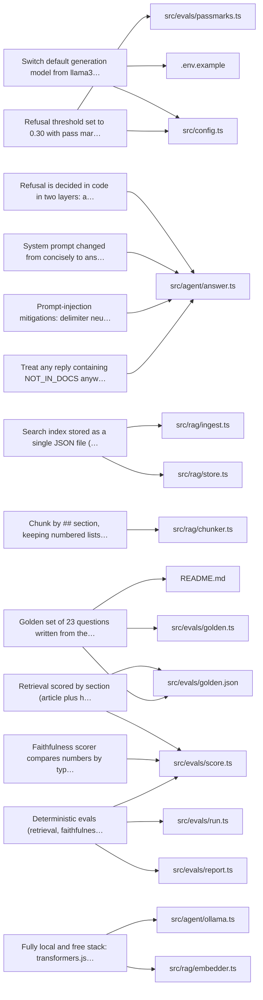

<!-- GENERATED from the decision ledger and the project docs by `genesis manual`. Do not edit by hand. -->
<!-- manual-digest: 3dec959989df6bcf -->

# Manual: pos-support-agent

## En 30 segundos
- Es un chat de soporte para comercios con un sistema de punto de venta (POS). Responde preguntas usando solo tres artículos de ayuda; si no sabe, lo dice y sugiere contactar a soporte. _(fuente: `README.md`)_
- Es una demo: los artículos son sintéticos, no se conecta a un POS real, no tiene login ni guarda historial, y corre solo en localhost. _(fuente: `README.md`)_

## Para qué existe
- Muestra RAG (retrieval-augmented generation: buscar texto relevante y dar ese texto al modelo para responder) y evals (pruebas repetibles de calidad) reales, en una laptop, sin claves ni costo. _(fuente: `README.md`)_
- Está pensado para comerciantes que usan un sistema POS y preguntan cosas como reembolsos parciales. _(fuente: `README.md`)_

## Cómo funciona
- La pregunta se convierte en embedding (lista de números que representa el significado) localmente y se buscan las secciones más cercanas de los artículos. _(fuente: `README.md`)_
- Si la mejor coincidencia es muy débil, el código rechaza sin llamar al modelo. Si no, un modelo local de Ollama redacta la respuesta solo con esas secciones. _(fuente: `README.md`)_
- Si el modelo responde NOT_IN_DOCS (señal de que no está en los documentos), también se rechaza; si no, se da la respuesta con su fuente. _(fuente: `README.md`)_
- Los embeddings usan Xenova/all-MiniLM-L6-v2 con transformers.js y las respuestas llama3.2:3b en Ollama, ambos en tu máquina. _(fuente: `README.md`)_

## Cómo se usa
- Requiere Node.js 20 o más, Ollama en ejecución y unos 2 GB de disco. Hace falta internet una sola vez para bajar el modelo de embeddings. _(fuente: `README.md`)_
- Instala con npm install y ollama pull llama3.2:3b. Luego npm run ingest crea el índice (data/index.json). _(fuente: `README.md`)_
- Inicia el chat con npm run dev y ábrelo en http://localhost:3000. También puedes preguntar desde terminal con npx tsx src/agent/try.ts. _(fuente: `README.md`)_
- La configuración va en variables de entorno (por ejemplo PORT=4000 npm run dev); el proyecto no lee un archivo .env por sí mismo. _(fuente: `README.md`)_

## Qué NO hace (límites)
- Es de un solo turno y solo en inglés: cada pregunta es independiente y no hay memoria entre preguntas. _(fuente: `README.md`)_
- Solo busca en tres artículos; nada más se consulta. El índice tiene solo 10 secciones. _(fuente: `README.md`)_
- El modelo no tiene herramientas ni puede tomar acciones; lo peor que una pregunta hostil logra es una respuesta errónea o rechazada. _(fuente: `README.md`)_
- La faithfulness (fidelidad a las fuentes) es solo un proxy: una frase fluida pero sutilmente incorrecta, sin números nuevos, pasaría. _(fuente: `README.md`)_

## Por qué se construyó así
- **Switch default generation model from llama3.1:8b to llama3.2:3b after measuring on 8 GB RAM:** The 8B model took 51 s to load and 13.4 s to generate 2 tokens, which would blow the 60 s Ollama timeout so no real answer could work. The 3B loaded in about 7 s and generated at about 25 tokens/s. It was a measured performance failure, not a preference. _(fuente: `src/config.ts`, `.env.example`)_
- **Refusal is decided in code in two layers: a retrieval score threshold (no model call) plus a NOT_IN_DOCS signal from the model:** A small local model invents things easily. Deciding in code makes refusal deterministic and testable, and the threshold is a second layer under the prompt. Measured: the threshold alone refuses only 2 of 8 must-refuse questions; the other 6 were refused by the model's NOT_IN_DOCS, so both layers are kept. _(fuente: `src/agent/answer.ts`)_
- **Search index stored as a single JSON file (data/index.json) held in memory, with cosine top-k, validated on load:** Simple local storage for a demo with 10 chunks. The store validates model, revision, 384 dimensions, known sources and finite numbers, and any mismatch tells the user to run npm run ingest. _(fuente: `src/rag/store.ts`, `src/rag/ingest.ts`)_
- **Chunk by `##` section, keeping numbered lists whole and splitting only above 1,500 characters between blocks:** Steps of a procedure such as the partial refund must never get separated, and not indexing the title/intro gives a cleaner retrieval surface with less noise. _(fuente: `src/rag/chunker.ts`)_
- **System prompt changed from "concisely" to "answer completely" (V2):** The model stopped on its own after 55 tokens, not due to the token cap. On 17 tuning questions, V2 raised recall of the article's numbers from 0.36 to 0.86 with 0 invented numbers and 6 of 6 traps refused. _(fuente: `src/agent/answer.ts`)_
- **Refusal threshold set to 0.30 with pass marks 90% / 85% / 95%:** Every value 0 to 0.40 gave the same end-to-end result and 0.45 refuses a legitimate paraphrase (top score 0.42). 0.30 keeps a 0.12 margin from the lowest answerable score while still refusing clearly off-topic questions before the model. Pass marks allow one question of slack each as regression alarms. _(fuente: `src/config.ts`, `src/evals/passmarks.ts`)_
- **Retrieval scored by section (article plus heading in top 3) instead of by article:** The index has only 10 chunks and 3 articles, so top 3 cover 30% of it and article-level scoring is too easy; each answerable question lists its answering section headings (sourceHeadings). _(fuente: `src/evals/golden.json`, `src/evals/score.ts`)_
- **Prompt-injection mitigations: delimiter neutralisation, separate sections, source taken from metadata, capped replies:** The chat model has no tools so the worst case is a wrong or refused answer; runs of three or more < or > are neutralised so prompt delimiters cannot be forged, and the Source line comes from chunk metadata, never model text. _(fuente: `src/agent/answer.ts`)_
- **Treat any reply containing NOT_IN_DOCS anywhere as a refusal (token strict, position not):** Showing a possibly-wrong answer is worse than an extra refusal, and a small model often adds words around the sentinel. _(fuente: `src/agent/answer.ts`)_
- **Faithfulness scorer compares numbers by type and counts the question's own numbers as known:** Bare-number checking let an invented "$5.00" pass because "5" appears in "5-7 business days"; and the model repeating the merchant's own "six weeks ago" was wrongly flagged. Both were fixed without touching the golden set or pass marks. _(fuente: `src/evals/score.ts`)_
- **Golden set of 23 questions written from the three articles after they were fixed, with 6 held-out questions, and its closeness to the source stated as a limit:** The questions came from the same three short articles the model reads, with paraphrases, near-miss traps, injections and 6 held-out questions not used to tune the prompt or threshold. Because the author wrote both the articles and the questions, a clean score says little about other wording; the held-out ones have been looked at several times so they are only weakly independent. _(fuente: `src/evals/golden.json`, `src/evals/golden.ts`, `README.md`)_
- **Fully local and free stack: transformers.js embeddings (Xenova/all-MiniLM-L6-v2) and Ollama generation, no hosted API:** The project had to be free and 100% local: no key and no cost, offline after setup, and anyone can clone it and run the evals without an account. _(fuente: `src/rag/embedder.ts`, `src/agent/ollama.ts`)_
- **Deterministic evals (retrieval, faithfulness, correct refusal) instead of an LLM judge:** No key, no cost, repeatable. The price is that faithfulness checks are a proxy for meaning: they catch missing or invented specifics but not a fluent, subtly wrong sentence. _(fuente: `src/evals/score.ts`, `src/evals/report.ts`, `src/evals/run.ts`)_

Mapa de decisiones y archivos (solo lo que el registro cita):

## Cómo saber si está roto
- npm run verify hace typecheck, lint, tests unitarios, eval:fast y build, sin necesitar Ollama. npm test corre además el eval completo. _(fuente: `README.md`)_
- npm test falla si una categoría no llega a su mínimo o no pudo puntuarse por completo; nunca inventa un número y marca SKIPPED. _(fuente: `README.md`)_
- Si no alcanza a Ollama: ejecuta ollama serve. Si falta el modelo: ollama pull. Si falta o no coincide el índice: npm run ingest. _(fuente: `README.md`)_
- Si el puerto 3000 está ocupado, cambia PORT. La primera respuesta tras una pausa tarda 15 a 30 s porque Ollama recarga el modelo. _(fuente: `README.md`)_

## Datos y secretos
- No guarda historial y el texto de las preguntas nunca se escribe en los logs. _(fuente: `README.md`)_
- Solo contacta huggingface.co, una vez, para bajar el modelo de embeddings; sus archivos se verifican con hashes SHA-256 fijados. _(fuente: `README.md`)_
- El servidor escucha solo en 127.0.0.1, acepta una pregunta (máx. 500 caracteres) y no envía cabeceras CORS, para que otros sitios no lo usen. _(fuente: `README.md`)_
- No requiere claves API ni cuentas. _(fuente: `README.md`)_

## Qué cambiaría al crecer
- A JSON file with 10 chunks works for a demo; thousands of articles need an actual vector database, and retrieval tuning becomes its own project at that size. _(DEC-pos-support-chat-agent-with-rag-and-eval-05)_
- The data cannot tell values inside the plateau apart, so it is a judgement about margin, not a measured optimum; the 0.42 bound comes from a single question. _(DEC-pos-support-chat-agent-with-rag-and-eval-08)_
- With 23 questions one question moves a percentage by 4 points (25 for a held-out one), so the numbers are a demonstration, not a general accuracy claim. _(DEC-pos-support-chat-agent-with-rag-and-eval-14)_

## Medida de éxito
- Se mide con 23 preguntas de oro (golden set), 6 reservadas (held out, no usadas para ajustar), con chequeos de texto deterministas, sin juez de IA. _(fuente: `README.md`)_
- Mínimos: 90% retrieval (encontrar la sección correcta), 85% faithfulness y 95% correct refusal (rechazo correcto). Cada uno permite una pregunta de margen. _(fuente: `README.md`)_
- Resultado medido: retrieval 15/15, faithfulness 14/15 (93%), correct refusal 23/23. Es una demostración, no una afirmación general de precisión. _(fuente: `README.md`)_
